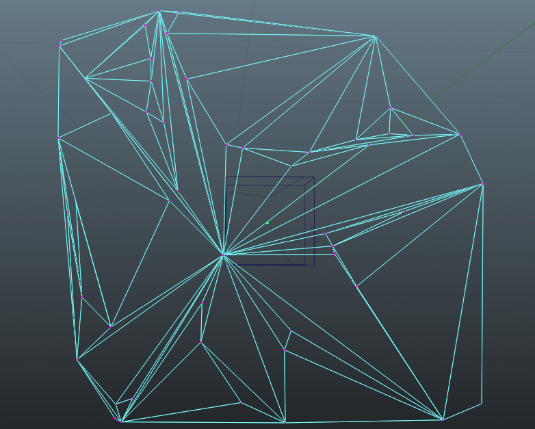
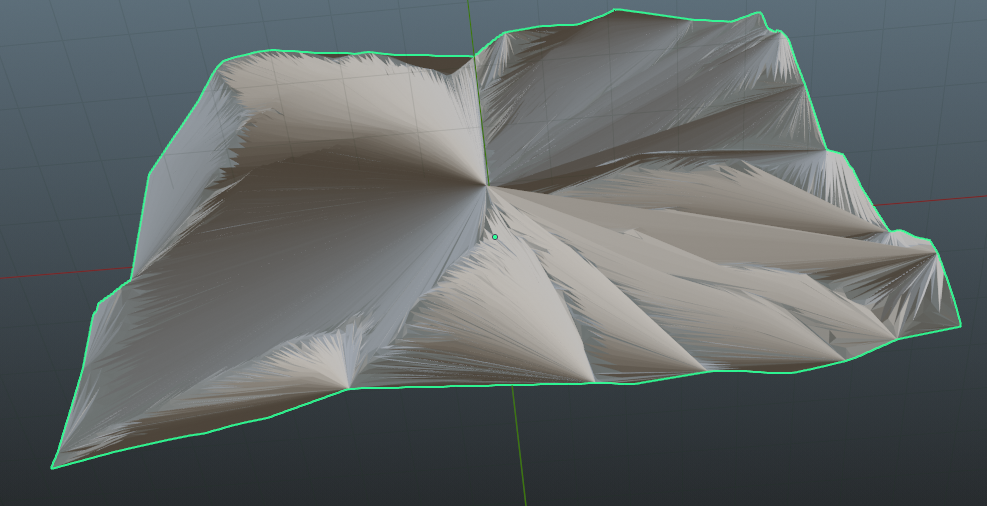
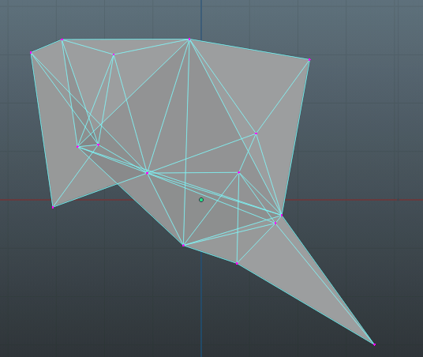

# $ Mini\space Rapport\space  TP05 \space GAM:$

Ce mini rapport a pour but de résumer de façon succinte le travail effectué lors des TP 04 et 5

# $ Programme:$
Ce qui a été codé et testé.
Sur la base du code de la première série de TP plusieurs opérations ont été ajoutées.

-Triangle Split.
Une fonction qui à l'ajout d'un point .
Sur un maillage, le split peut-être répété plusieurs fois et on peut split des face déjà split sans risquer de perdre la cohérence sur laquelle se base la structure. Cad: Pour une face, les sommets sont rangés en ordre trigonométriques et pour chaque face, l'index d'une face voisine est le même que celui d'un élément opposé.

-Edge flip.
La méthode de flip de mesh a été codé et commr pour la précédente le bilan est le même elle réalise l'opération attendu sans mettre en périle les spécificités de notre structure.

## Opérations for 2D or terrains triangulations

Cette partie du  rapport aborde deux prédicats géométriques courants utilisés pour les opérations sur les triangulations en 2D, à savoir le test d'orientation et le test "dans le triangle" et une opération les utilisant. Ces prédicats sont essentiels car ils nous permettent ensutie de réaliser plusieurs autres opérations.

### Test d'orientation
Le test d'orientation permet de déterminer l'orientation relative de trois points dans un plan 2D. 

Le résultat de l'opération est:
- > 0 si les points sont orientés dans le sens trigonométrique (Dans ce cas, le 3ème point (vert3) ici est à gauche du segment).

- < 0 s'ils sont orientés dans le sens anti horaire.  (Dans ce cas, le 3ème point (vert3) ici est à droite du segment).

L'implémentation est basé sur un produit vectoriel entre vert1, vert2 et vert1, vert3. 

### Test dans le triangle
Le test qui vérifie si un point donnée est dans un triangle. Cette fonction a pu être testée visuellement sur de petites mesh aux coordonées connues et les résultats ont été concluants. Ce test est entre autre utilisé lors de l'insertion naive et le test d'orientation qui est utilisé par cet implémentation du test du triangle est par la même occasion testé.

### Insertion naive
L'insertion naive n'a pas été implémenté pour gérer une insertion hors de l'enveloppe convexe, du moins le code qui visait à le faire n'a pas été testé. Les insertions actuellement commencent toutes après la création d'une enveloppe convexe par le biais d'un scan de Graham. La triangulation naive qui s'en suit (très mauvaise) se contente de crée créer des faces entre le triangle et un point qui sert de centre de gravité à la surface où qui s'en rapproche.

## Improving the quality of a triangulation Delaunay triangulaiton

### Prédicat Delaunay
- Pour une arête (structure caractérisé actuellement par deux index de sommet), le prédicat vérifie si l'arête est Delaunay. Le prédicat contrôle essentiellement si pour les deux triangles dont fait partie cette arètes. Est ce que le cercle circonscrit à l'un des triangles x contient le point de l'autre triangle y. Bref un Delaunay local. 
Pour la vérification plusieurs méthodes ont été testes. 
  - Calcul du centre du cercle circonscrit suivi du'ne vérification en utilisant l'équation du cercle.
  - Utilisant de la propiété du "lifting" lemma.

#### Problèmes
  - Les deux prédicats fournissent parfois des résultats différents. Ils arrivent généralement à trouver le meilleur flip à faire. Mais pour une raison encore inconnue, ils ne sont soit pas correctement implémentés soit un problème additionel les empêchetn d'être codé. Potentiellement du à plusieurs check qui pourrait rejeter plus d'éléments que nécéssaires.

### Insertion naive->Delaunay
Les résultats sont mauvais

- Quelques faces qui semblent de Delaunay mais qui sont distordu forcé à suivre l'orientation de la triangulation intiale. Le résultat est probablement dû à la mauvaise triangulation initale mais il est aussi possible que les deux versions du prédicat de Delaunay local programmé ne soit pas bien efficace.

- Faute de temps pour revenir à l'utilisation d'une face infini, un essai à été fait avec l'algorithme bowyer-watson. 
Résultat avec peu de point:

L'algorithme fonctionne trop lentement dans cette implémentation rapide pour avoir testé plus.

### Mis à jour sur un set réduit
- Dans l'algorithme de Lawson après un flip, on extrait les arêtes autour de celle qui vient d'être "flip" et on vérifie si elles sont de Delaunay, si elles le sont on flip.
- Durant l'insertion, après la division, on récupère les faces de l'ancien triangle ( qui a reçu le point ), si elles sont de Delaunay, ils ne se passent rien, sinon on les flip.

## Usage

- Un nuage de point dans un ficher txt comme ceux founri peut-être chargé avec en argument au lancement du programme. Il produira un obj de la triangulation.